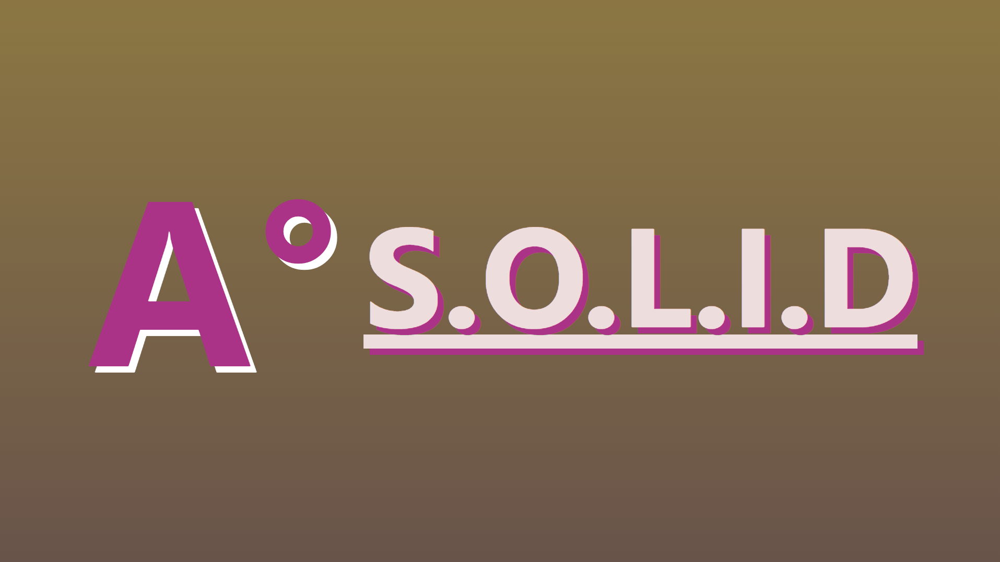

 
<h1 align="center">
   
    Angular and SOLID Design Principles
   
   
  
</h1>
 
<h3 align="center">
An example Angular web app developed in phases with SOLID design principles, from monolithic to modular.
</h3>
 
 

*SOLID* is a mnemonic acronym for a set of 5 software design principles as followed:
- Single-responsibility principle
- Open-closed principle
- Liskov substitution principle
- Interface segregation principle
- Dependency inversion principle

In this example Angular web app, we'll take a basic, monolithic to-do app and apply each of the 5 principles to it in phases until our app is completely SOLID.

Start with [Phase 1](/src/app/01-the-monolith) of development to view the monolithic app and begin seeing SOLID applied accordingly.
